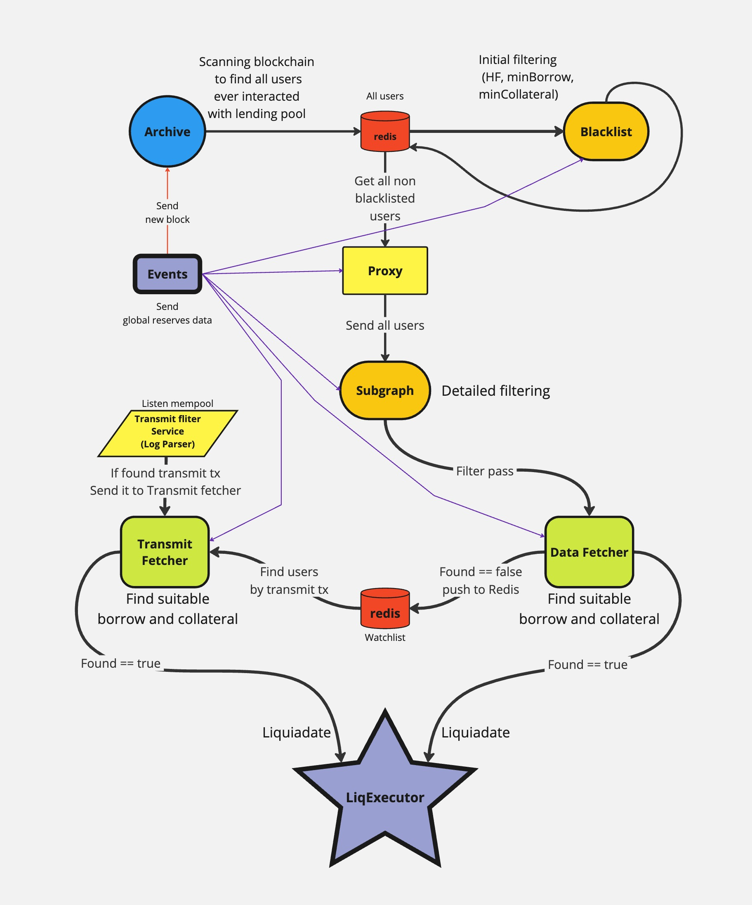

# Liquidation Registry

[Detailed documentation can be found in the `doc` folder](./doc)

## Introduction to the Liquidator Service

The Liquidator service is a service that tracks potential positions for liquidations and subsequently liquidates them. Currently, Liquidator operates in DeFi liquidity protocols such as AAVE V1, AAVE V2, AAVE V3, and Compound. The main goal of the project is to identify users who are in the liquidation risk zone and liquidate their positions while making a profit from the liquidations.

## Structure of the Liquidator Service

The Liquidator service consists of two main sub-services:

1. **LiqRegistry**: Responsible for collecting and filtering users who have interacted with supported liquidity protocols. It finds potential positions for liquidation.
2. **LiqExecutor**: Responsible for executing the liquidation of user positions identified by LiqRegistry.

This documentation focuses on describing the business logic of the LiqRegistry service.

## Business Logic of LiqRegistry

LiqRegistry works with liquidity protocols AAVE V1, AAVE V2, AAVE V3, and Compound. The main task of the service is to find users who have taken a loan in any of these protocols and track their Health Factor (an indicator of how close the user is to liquidation), Borrow, and Collateral.

The LiqRegistry process can be divided into three main stages:

1. **Blockchain filtering**: The service filters the entire blockchain to find users who have interacted with one of the four supported protocols.
2. **User filtering**: Found users are filtered based on certain criteria such as minimum loan size (Borrow), minimum collateral size (Collateral), and Health Factor.
3. **Detailed analysis of selected users**: More detailed analysis of certain users. Analysis of their assets in Borrow and Collateral. Also, simulation of Health Factor changes based on price change transactions (Transmit).
4. **Data transfer to LiqExecutor**: After filtering, information about users subject to liquidation is transferred to the LiqExecutor service for liquidation execution.

LiqRegistry is a key component of the Liquidator system, responsible for finding and tracking liquidity protocol users potentially suitable for liquidation. LiqRegistry consists of seven sub-services, each performing a specific role in the process of filtering and monitoring users:

1. **Archive** - collects all users who have ever interacted with each individual protocol, starting from the protocol creation block. Archive also tracks new users in real-time.

2. **Blacklist** - the first stage of filtering users by Health Factor, MinBorrow, and MinCollateral parameters. It filters out users whose parameters are too far from potentially interesting for liquidation.

3. **Proxy** - an auxiliary service for Subgraph that distributes users among Subgraph instances for efficient processing.

4. **Subgraph** - filters users, focusing on those whose Health Factor, MinBorrow, and MinCollateral parameters are close to the possibility of liquidation. Sends filtered users to DataFetcher.

5. **DataFetcher** - makes decisions about liquidating users or adding them to the WatchList for further monitoring based on detailed analysis of their parameters.

6. **TransmitFetcher** - monitors Transmit transactions in the mempool to detect changes in token prices affecting the Health Factor of users from the WatchList, allowing them to be liquidated in the same block where the Health Factor changes.

Additionally, the

7. **Events** service is responsible for monitoring new block outputs, sending these blocks via MQTT, and updating globalReservesData.

All these services work as a single mechanism, gradually narrowing down the list of users at each stage to ultimately identify those most suitable for liquidation and pass these users to the next service, liqExecutor. This approach allows efficient use of limited system resources when working with a large number of liquidity protocol users.

## Business Logic of LiqExecutor

After finding positions for liquidation by the LiqRegistry service, LiqExecutor analyzes the possibility of liquidation and potential profit from it, considering possible liquidation paths, gas price for the liquidation transaction, etc.

## Services architecture Flow

[Detailed services architecture can be found in the `doc/` folder](./doc/eng/3_serviceArchitecture.md)

You can find detailed documentation in folder `doc`

# Project Launch

## General Instructions

To launch the project, you need to perform the following steps:

1. Make sure you have pm2 installed: `npm install -g pm2`
2. Install npm packages with the command: `npm install`
3. Set up all necessary infrastructure (Infrastructure Setup section)
4. Launch all services with the command: `npm run all`
5. To stop a specific service, use the command: `pm2 stop <service name or namespace>`
6. To completely stop all services, use the command: `pm2 stop all`
7. After updating the code, always execute the following commands, otherwise changes will not be accounted for in pm2: `pm2 stop all` `npm run all`

## Infrastructure Setup

The project infrastructure has two environments: development and production. For each of these environments, you need to enable its own VPN.

## Connecting to Redis

Configuration file: `configs/Main.json`

## Connecting to MQTT host

Configuration file: `sys.config.json`

## Connecting to Ethereum node

Configuration file: `configs/Main.json`

Note: For initial scanning, the Archive service must have access to an archival full Ethereum node.

## Access to local Enso simulator

It is necessary to ensure access to the local Enso simulator for the correct operation of services.

Links to the Enso simulator are specified in the files:

- `configs/workers/blacklistServices.json`
- `configs/workers/subgraphServices.json`
- `configs/workers/dataFetcherServices.json`
- `configs/workers/transmitFetcherServices.json`

## Service Dependencies

All services depend on `globalReservesData`, which comes on the topic `data/reserves/` (for example, `data/reserves/V1`). If your services have started but nothing is happening, check if the reason is that `globalReservesData` updates from the `Events` service have not arrived.

Note: Events service is in the repository

## Transmit Fetcher Service Dependency

The Transmit Fetcher service depends on an external service that sends transactions on the topic `listener/transmit`. Service name: `ETH_ImpossibleParser`
https://github.com/CybridgeTechnologies/ETH_ImpossibleParser

Tip: You can subscribe to topics from the terminal to check if transmits are coming:
`mqtt sub -h "<your_mqtt_host>" -t "listener/transmit"`

Note: Transmits come quite rarely, waiting time can be up to 30 minutes.

## Log Tracking

For tracking logs on prod or dev infrastructure, the `UniversalLogger.js.log` service must be running

(Optional) https://github.com/CybridgeTechnologies/UniversalLogger.js.log

## Running in debug mode

Running in debug mode is done with the command:
`npm run debug<ServiceName> <Protocol><ServiceName>`
For example:
`npm run debugProxy V1Proxy`

To run the events service in debug mode, you don't need to specify the protocol name, as the service is common for all protocols.
To run events in debug mode
`npm run debugEvents Events`

## Launch Scripts

All launch scripts can be found in `package.json`

I'd be happy to translate more sections if you need. Would you like me to continue with the next part?

Here's the literal translation of the provided section into English:

# Updates

## 2024-05-13

1. Created branch V.0.0.7
2. Migrated the blacklist service to the new architecture.
3. Integrated the new blacklist into the proxy service.
4. Added some log events and comments to other services.

## 2024-05-2

1. Fixed a bug where 29/30 users were skipped in the transmitFetcher.
2. Refactored the transmitFetcher for better readability.
3. Changed the names of some functions in transmitFetcher and dataFetcher for better understanding of their purpose.
4. Added symbols: ✓ x ○ E to the logs for better visual readability.
5. Changed the names of some logs for better understanding of their contents.

## 2024-04-12

1. Duplicated console.log's to mqqt logger

## 2024-04-09

1. The events service was transitioned to a new architecture.
2. The service can now receive new blocks via ws, that significantly reducing the load on the Ethereum node.
   In eventsServices.json, users can choose between WebSocket (ws) and http modes.
3. Logging has been added to an MQTT logger, enhancing the service's monitoring capabilities.

## 2024-04-03

1. Code review was conducted by noizyman and AlexSerbinov.
2. In the proxy stage (after the blacklist), all user addresses are converted to toLowerCase().
3. Events have been modified to comply with the new logger. Unused events have been removed.
4. Unused parameters have been removed from main.json.
5. Configurations from defaultSettings have been migrated to the parameters of each individual service.
6. Many parameters have been moved to [serviceName]Services.json.
7. Many new comments have been added to the code.

## 2024-03-29

1.  Migrated the Archive service from using a database to Redis.

## 2024-03-26

1.  Transitioned Archive to a new architecture.

## 2024-03-22

1.  Switched the simulator to use a transaction simulator instead of a node.
2.  Changed the queue mechanism to process users in batches of 20, instead of one by one.

## 2024-03-15

1.  Upgraded Subgraph to a new architecture. Set up message reception from the Proxy service.
2.  Configured round-robin operation correctly.

## 2024-03-08

1.  Developed the Proxy service. The Proxy service now forwards users to the Subgraph service.

## 2024-02-29

1. Migrated the `dataFetcher` service to a new architecture. The configuration file for launching services is located in `services.json`.
2. Standartised all js files with prettier and .pretierrc file config was added to git repo.

## 2024-02-27

1. Migrated the `transmitFetcher` service to a new architecture. The configuration file for launching services is located in `services.json`.
2. Removed all database (db) related components as part of the migration process.
3. Renamed various files and folders to better align with the new architecture and naming conventions.
4. Deleted unused `helpers` to streamline the codebase and improve maintenance efficiency.
5. Removed old MQTT notifiers. Now, we use `$.send` from the new architecture for notifications.

## 2023-09-11

1. Added new service "Blacklist". Service checks hf, collateral, borrow for users from Archive service and
   adds user to blacklist in Redis, key`s template : 'liq-registry:blacklist:[protocol]'. Blacklist service
   works by loop.
2. Added new module for work with Redis DB, info in folder "redis".
3. Added blacklist checking to subgraph service. Code using redis module check every user to exists in Redis blacklist
   if user is in redis blacklist, subgraph skips processing.

## 2023-09-12

1. Assembled Searcher service for MakerDAO.
2. Update events.service with Maker events.

## 2023-09-18

1. Fixed BlackList startup.
2. Added pm2 configs.

## 2023-09-20

1. Subgraph: Fixed subgraph run by loop
2. Redis: Changed package for work with Redis to ioredis
3. Redis: Added methods for work with redis set
4. Blacklist: Changed functions for use redis set
5. Subgraph: Changed function for use redis set (multi checking)

## 2023-10-03

1. Added a new service, DataFetcher (similar to searcher).
2. Added functions to the Redis module to work with the new services, DataFetcher and TransmitFetcher. (DataFetcher handles writing/deleting, while TransmitFetcher handles reading).
3. Important notice! Old searcher runs only: Liquity, Maker_DAO. New service DataFetcher runs: V1, V2, V3, Compound
4. Fix archive for running on prod (getLatestRedisBlock: let latestArchiveBlock = 0)

## 2023-10-31

1. History: Add transmit txn to liquidations from history
