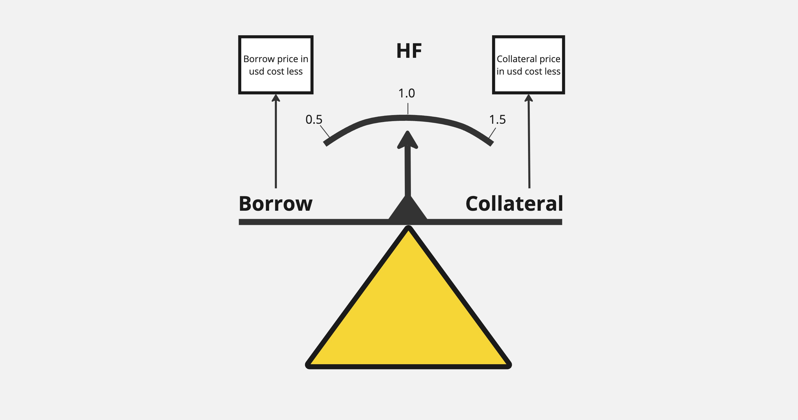

# User Liquidation and Liquidity Protocols

In the world of decentralized finance (DeFi), liquidity protocols play an important role in ensuring the functioning of the ecosystem. These protocols allow users to borrow and lend cryptocurrency assets using smart contracts on the Ethereum blockchain. However, when users cannot repay their loans, there is a need to liquidate their positions to protect the protocol and other participants. In this section, we will look at the concept of user liquidation, the role of liquidity protocols such as Aave and Compound, and the importance of tracking potential users for liquidation.

## What is User Liquidation?

User liquidation is a process where a liquidity protocol automatically closes the position of a user who cannot repay their debt. When a user takes a loan in a liquidity protocol, they must provide collateral in the form of cryptocurrency assets. If the value of the collateral falls below a certain threshold (usually 150% of the loan amount), the protocol initiates liquidation.

During liquidation, the protocol sells the user's collateral on the open market to repay the debt and penalties. If the proceeds are insufficient, the protocol distributes the losses among liquidity providers. Liquidation is an important mechanism for maintaining the stability and security of liquidity protocols.

## Tracking Potential Users for Liquidation

For the effective functioning of liquidity protocols and protection of liquidity providers, it is important to track potential users who can be liquidated. A project that deals with this task can significantly improve the stability and security of the DeFi ecosystem.

Tracking potential users for liquidation involves monitoring liquidation ratios, collateral values, and loan amounts of users in real-time. When a user's liquidation ratio approaches the critical threshold, the project can notify liquidators about the possibility of liquidating the position.

This approach allows liquidators to quickly react to potential liquidations and more effectively protect liquidity protocols from losses. In addition, tracking potential users for liquidation can provide valuable information for liquidity providers, helping them make informed decisions about allocating their assets.

## What is Health Factor (HF)?

Health Factor (HF) is a key indicator in DeFi lending protocols that determines the stability of a user's position. It is calculated as the ratio of the collateral value to the loan amount, taking into account the liquidation threshold.

Health Factor can be visualized as a balance scale where:

- On one side is the collateral value
- On the other side is the loan amount (Borrow)
- The pointer shows the current HF

When HF = 1, the scale is balanced. If HF < 1, the position is at risk of liquidation. An HF > 1.5 is considered safe.

- HF decreases when:
  - The loan amount increases
  - The collateral value decreases
- HF increases when:
  - The loan amount decreases
  - The collateral value increases

## Liquidity Protocols

### Aave

Aave is a decentralized liquidity protocol that allows users to borrow and lend a wide range of cryptocurrency assets. The protocol has three main versions:

1. Aave v1: The first version of the protocol, launched in January 2020. It introduced the concept of liquidity pools and flash loans.

2. Aave v2: The second version, released in December 2020, added new features such as whitelists, delegated lending, and improved gas efficiency.

3. Aave v3: The latest version of the protocol, launched in March 2022. It introduced capital efficiency, isolated liquidity pools, and translation gateways for better compatibility with other blockchains.

Aave uses an auction-based liquidation algorithm where liquidators compete for the right to liquidate a user's position. The protocol also has an incentive system for liquidators, paying them a reward for successful liquidation.

### Compound

Compound is another popular liquidity protocol that allows users to earn interest on their cryptocurrency assets and borrow them. The protocol uses a pool-based model where users deposit their assets into a shared pool and receive cTokens that represent their share in the pool.

When a user takes a loan in Compound, the protocol automatically calculates the liquidation ratio based on the collateral value and loan amount. If the ratio falls below the set threshold, the protocol allows liquidators to close the user's position and receive a reward.

A project tracking potential users for liquidation can work closely with liquidity protocols such as Aave and Compound to ensure effective monitoring and timely notification of liquidators about liquidation opportunities.

## Conclusion

User liquidation is an important aspect of the functioning of liquidity protocols such as Aave and Compound. This mechanism ensures the stability and security of the DeFi ecosystem, protecting protocols and liquidity providers from losses. Tracking potential users for liquidation is a key component of this process, allowing liquidators to quickly react to potential liquidations and more effectively protect protocols.

Understanding the concept of liquidation, the role of liquidity protocols, and the importance of tracking potential users for liquidation is important for all participants in the DeFi space. Projects that deal with this task can significantly improve the stability, security, and efficiency of the decentralized finance ecosystem.
