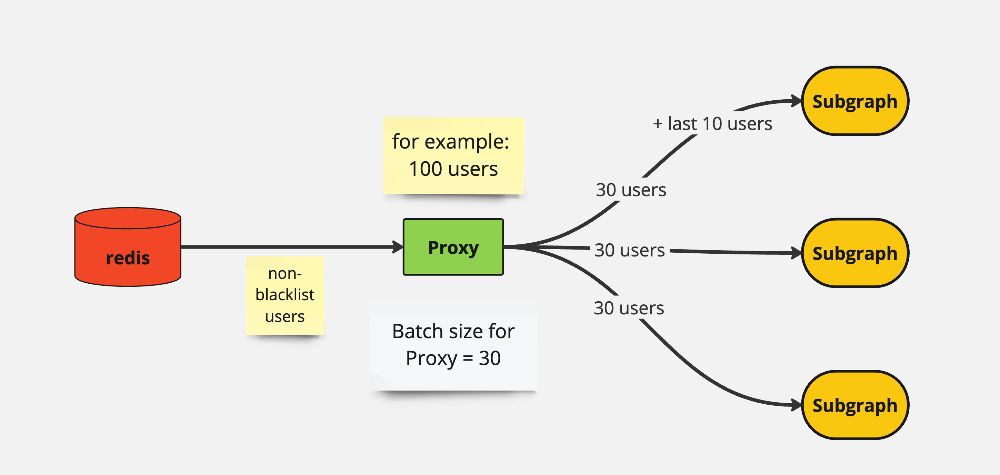

# Запуск проекту

## Загальні інструкції

Для запуску проекту необхідно виконати наступні кроки:

1. Переконайтесь, що у вас встановлено pm2: `npm install -g pm2`
2. встановіть npm пакети командою: `npm install`
3. Налаштуйте всю необхідну інфраструктуру (розділ Налаштування інфраструктури)
4. Запустіть всі сервіси командою: `npm run all`
5. Щоб зупинити конкретний сервіс, використовуйте команду: `pm2 stop <назва сервісу чи неймспейсу>`
6. Щоб повністю зупинити всі сервіси, використовуйте команду: `pm2 stop all`
7. Після оновлення коду обов'язково виконуйте наступні команди, інакше зміни не будуть враховані у pm2: `pm2 stop all` `npm run all`

## Налаштування інфраструктури

Інфраструктура проекту має два оточення: девелопмент і продакшн. Для кожного з цих оточень необхідно ввімкнути свій VPN.

## Підключення до Redis

Файл конфігурації: `configs/Main.json`

## Підключення до MQTT хоста

Файл конфігурації: `sys.config.json`

## Підключення до Ethereum ноди

Файл конфігурації: `configs/Main.json`

Примітка: Для початкового сканування сервісом Archive має бути доступ до архівної full ноди ефіріум.

## Доступ до локального Enso симулятора

Необхідно забезпечити доступ до локального Enso симулятора для коректної роботи сервісів.

Лінки на Enso симулятор прописуються в файлах:

- `configs/workers/blacklistServices.json`
- `configs/workers/subgraphServices.json`
- `configs/workers/dataFetcherServices.json`
- `configs/workers/transmitFetcherServices.json`

## Залежності сервісів

Всі сервіси залежать від `globalReservesData`, що надходять на топік `data/reserves/` (наприклад, `data/reserves/V1`). Якщо ваші сервіси запустилися, але нічого не відбувається, це означає, що не надійшли оновлення `globalReservesData` від сервісу `Events`.

Примітка: Events сервіс є в репозиторії

## Відслідковування логів

Для відслідковування логів на прод чи дев інфраструктурі має бути запущений сервіс `UniversalLogger.js.log`

(Опціонально) https://github.com/CybridgeTechnologies/UniversalLogger.js.log

## Залежність сервісу Transmit Fetcher

Сервіс Transmit Fetcher залежить від зовнішнього сервісу, який надсилає транзакції по топіку `listener/transmit`. Назва сервісу: `ETH_ImpossibleParser`
https://github.com/CybridgeTechnologies/ETH_ImpossibleParser

Порада: Ви можете підписатися на топіки з терміналу, щоб перевірити, чи надходять трансміти:
`mqtt sub -h "<your_mqtt_host>" -t "listener/transmit"`

Примітка: Трансміти надходять доволі рідко, час очікування може бути до 30 хвилин.

## Запуск в debug режимі

Запуск в debug режимі відбувається командою:
`npm run debug<ServiceName> <Protocol><ServiceName>`
Наприклад:
`npm run debugProxy V1Proxy`

Для запуску сервісу events в дебаг режимі назву протоколу вказувати не треба, так як сервіс спільний для всіх протоколів.
Для запуску events в debug mode
`npm run debugEvents Events`

## Скрипти для запуску

Всі скрипти для запуску можна знайти в `package.json`

### Опис архітектури

#### Вступ

Архітектура нашого проекту базується на системі Cinnamon, яку використовує більшість проектів нашої компанії. Ця архітектура передбачає використання деяких шаблонів і стандартів, які допомагають забезпечити уніфікованість і ефективність роботи всіх сервісів.

#### Файли конфігурацій

##### Глобальні конфігурації

Усі глобальні конфігурації зберігаються у файлі `configs/main.json`. Цей файл містить:

- URL і порт для Redis
- Лінки на Ethereum-ноду
- Інші загальні змінні, необхідні для роботи сервісів

##### Конфігурації сервісів

Кожен проект має свої власні конфігурації, які зберігаються в папці `config.workers`. Основний файл конфігурації для кожного проекту має назву `services.json`. У цьому файлі визначені:

- Об'єкт `Default Settings`, що містить спільні налаштування для всіх протоколів
- Налаштування для окремих протоколів (AAVE V1, AAVE V2, AAVE V3, Compound)

##### MQTT спілкування

У файлі `sys.config.json` вказаний URL для спілкування через MQTT-топіки. Усі сервіси нашої компанії, включаючи сервіси ліквідації, працюють через MQTT, відправляючи один одному повідомлення з певними топіками. Кожен сервіс має визначені топіки для відправки (`Notify`) і прослуховування (`Listen`).

##### Приклад конфігурації топіків

У конфігураційних файлах кожного сервісу вказані параметри `Notify` та `Listen`. Наприклад, у файлі `services.json`:

```json
{
  "Notify": ["topic1", "topic2"],
  "Listen": ["topic3", "topic4"]
}
```

#### Структура папок

##### Папка systems

Це головна папка, що містить основну архітектуру нашої системи.

##### Папка configs

Тут зберігаються всі конфігураційні файли.

##### Папка services

Містить вхідні точки для кожного сервісу.

##### Папка lib

Містить усі допоміжні бібліотеки. У папці `lib/services` зберігаються всі окремі підпроекти. Наприклад, проект `subgraph` має свою окрему папку з налаштуваннями та описом.

#### ООП шаблони

Усі сервіси побудовані за принципами об'єктно-орієнтованого програмування (ООП). Наприклад:

- **Fetcher** – основний клас для обробників
- **Fetcher.av** – клас для AAVE
- **Fetcher.av.v1**, **Fetcher.av.v2**, **Fetcher.av.v3** – класи для різних версій AAVE, що наслідуються від **Fetcher.av**

#### Механізм черги

Деякі з наших сервісів, такі як Blacklist і Subgraph, мають механізм черги. Мета черги – згладжувати пікові навантаження, які приходять на сервіс. Наприклад, сервіс Proxy відправляє на Subgraph десятки тисяч користувачів за декілька секунд. Subgraph додає цих користувачів у чергу і потім обробляє їх по одному або групами.

##### Приклад коду черги

#### Запуск сервісів

##### Екземпляри сервісів

Усі сервіси запущені в чотирьох екземплярах для кожного протоколу (AAVE V1, AAVE V2, AAVE V3, Compound). Наприклад, можна запустити всю систему (архів, проксі, subgraph, data fetcher і transmit) лише для одного протоколу, наприклад, V1.

##### Використання PM2

Сервіси запускаються через менеджер процесів PM2. Для запуску всіх сервісів використовується команда `npm run all`, яка запускає всі сервіси через PM2. Для дебагінгу можна використовувати команду `npm run debug [назва сервісу]`. Наприклад:

```sh
npm run debug subgraph v1
```

де `v1` означає версію протоколу.

#### Використання forks

##### Що таке forks

Кожен сервіс може працювати в режимі декількох forks, тобто одночасного запуску декількох інстанцій. Це може бути корисним для розподілу навантаження і підвищення продуктивності сервісу. Проте, наразі, немає сенсу запускати всі сервіси в режимі багатьох forks. Це має сенс лише для сервісу Subgraph, особливо коли потрібно, щоб один протокол (наприклад, AAVE V2) працював з декількома незалежними інстанціями симулятора.

##### Параметри forks

У конфігураційних файлах сервісів можна вказати параметр `forks` і `roundrobing`:

- **forks** – кількість одночасних інстанцій сервісу. Наприклад, якщо `forks=2`, то сервіс буде запущений у двох інстанціях.
- **roundrobing** – параметр, який визначає, як дані розподіляються між інстанціями:
  - **TRUE** – дані від MQTT надходять на інстанції по черзі. Наприклад, якщо запущено 2 інстанції Subgraph, то Proxy відправить перші 30 користувачів на першу інстанцію, а наступні 30 – на другу інстанцію.
  - **FALSE** – дані надходять на кожну інстанцію паралельно. Наприклад, Proxy відправить по 30 користувачів на кожну інстанцію одночасно.



## Висновок

Архітектура проекту побудована на системі Cinnamon і використовує стандартизовані шаблони для забезпечення уніфікованості і ефективності роботи. Кожен сервіс має свої конфігураційні файли, які визначають вхідні та вихідні точки, а також параметри для взаємодії з іншими сервісами через MQTT. Механізм черги допомагає згладжувати пікові навантаження, забезпечуючи стабільну роботу сервісів. Запуск сервісів здійснюється через PM2, що забезпечує стабільність і простоту управління процесами. Режим forks дозволяє масштабувати сервіси для підвищення продуктивності.
